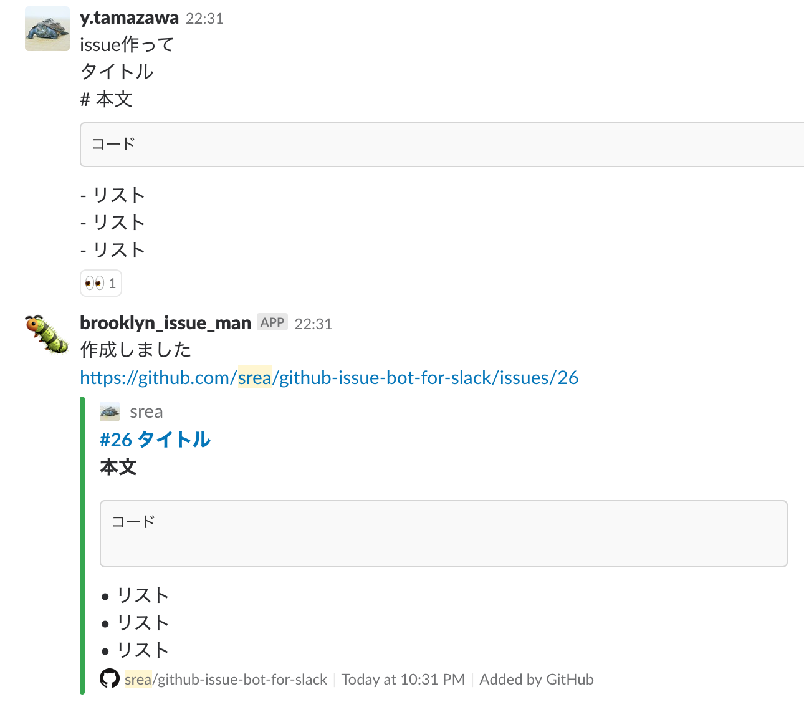
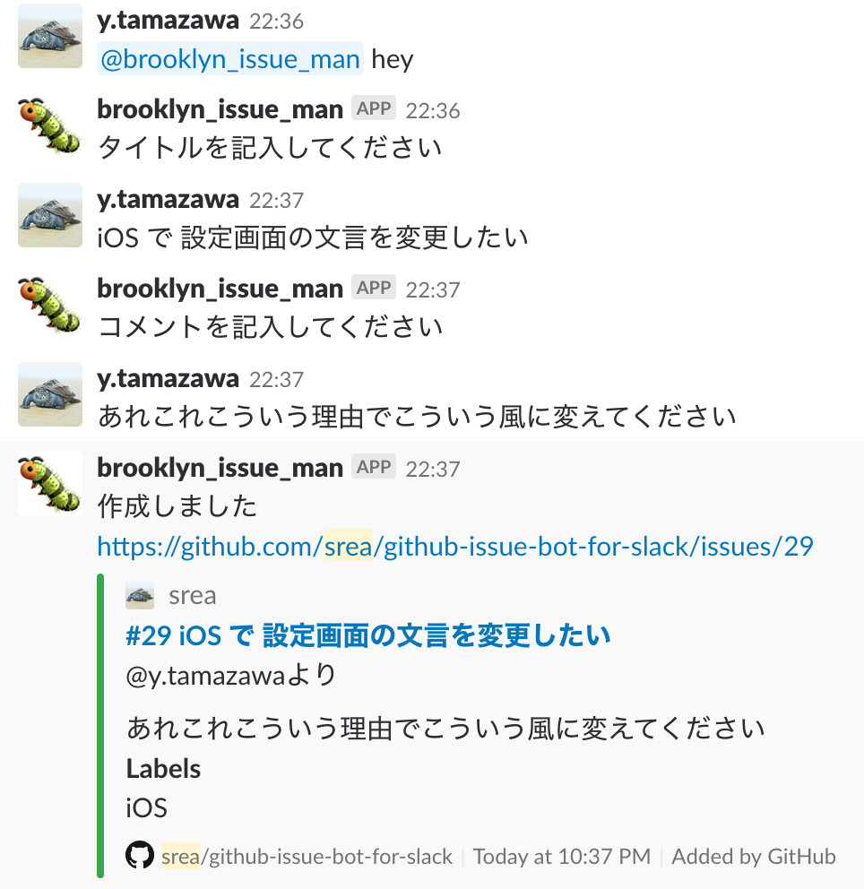

# github-issue-bot-for-slack
You can create new issue by interactive conversation with bot from slack.

```
$ SLACK_BOT_TOKEN=xxx GITHUB_USER=xxx GITHUB_REPO=xxx/xxx GITHUB_ACCESS_TOKEN=xxx node index.js
```

# example

## pattern 1



## pattern 2

